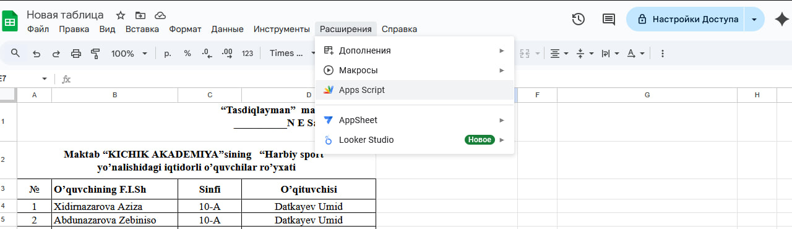
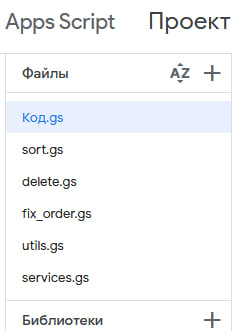
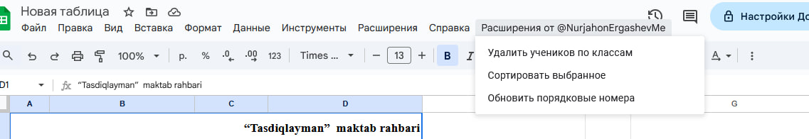

# Students Manager для Google Таблиц

Инструмент для автоматизации работы со списками учеников в Google Таблицах.

## 📋 Основные функции
- Автоматическая нумерация учеников
- Сортировка по классам (1А, 2Б и т.д.)
- Групповое удаление по выбранным классам

## 🛠 Установка

### Шаг 1. Открываем редактор скриптов

1. Откройте вашу Google Таблицу
2. Нажмите `Расширения` → `Apps Script`

### Шаг 2. Добавляем файлы скриптов

1. Удалите автоматически созданный файл `Код.gs`
2. Добавьте все файлы из папки проекта с расширением `.gs`:
   - `code.gs` - основной код
   - `services.gs` - вспомогательные функции
   - `delete.gs` - функции удаления

### Шаг 3. Использование

1. После сохранения проекта перезагрузите таблицу
2. В меню появится новый пункт "Расширения от @NurjahonErgashevMe"
3. Выберите нужную функцию из меню
